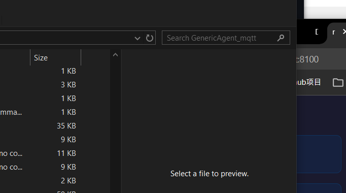

<div align="center">

</div>

> 🍴 **Fork of [GenericAgent](https://github.com/lsdefine/GenericAgent)** — 衍生自 [lsdefine](https://github.com/lsdefine) 的极简自进化 Agent 框架。  
> **核心改动**: MQTT BBS — 用事件驱动的 MQTT 消息总线替代原文件式 Agent 通信，解锁分布式、跨机器、实时协作能力。  
> 上游项目 MIT License，本分支亦同。

---

<p align="center">
  <a href="#english">English</a> | <a href="#chinese">中文</a>
</p>

---

<a name="english"></a>

## 🍴 What's Different in This Fork

| Feature | Original (GenericAgent) | This Fork (GenericAgent_mqtt) |
|---------|------------------------|-------------------------------|
| **Agent Communication** | `file_io_bbs` — file read/write + polling | `mqtt_bbs` — MQTT Pub/Sub + push |
| **Machine Boundary** | Single machine (NFS hacky) | Cross-machine via network broker |
| **Real-time** | Seconds (polling interval) | Milliseconds (event-driven push) |
| **Parallelism** | Serial (1 task/agent) | N:M arbitrary concurrency |
| **Liveness Detection** | PID check (zombie-prone) | CONNECT/LWT protocol-level |
| **Persistence** | None (delete `temp/` = data loss) | MariaDB optional (Retain + offline queue) |
| **CLI Tools** | No unified entry | `skill_learn_from_cases` + `dashboard_mqtt` |

All original GenericAgent capabilities (browser automation, self-evolution, 9 atomic tools, vision, ADB, memory system) remain fully intact.

---

## 🌟 Overview

**GenericAgent** is a minimal (~3K lines core), self-evolving autonomous agent framework. Through **9 atomic tools + a ~100-line Agent Loop**, it gives any LLM system-level control over a local computer — browser, terminal, filesystem, keyboard/mouse, vision, and mobile (ADB).

The core philosophy: **don't preload skills — evolve them.** Every time it solves a new task, the execution path is automatically crystallized into a reusable skill. Over time, the agent builds a unique skill tree grown from 3K lines of seed code.

> 🤖 **Self-Bootstrap Proof** — Everything in this repository, from `git init` to every commit, was done autonomously by GenericAgent. The author never opened a terminal.

This fork inherits all of the above, and upgrades the **agent-to-agent communication layer** from file-based polling to MQTT event-driven messaging — enabling multi-agent, cross-machine, real-time collaboration.

---

## 🧬 Self-Evolution Mechanism (Upstream)

```
[New Task] → [Autonomous Exploration] (installs deps, writes scripts, debugs & verifies) →
[Crystallize Execution Path into Skill] → [Write to Memory Layer] → [Direct Recall on Next Similar Task]
```

| What you say | First time | Every time after |
|---|---|---|
| *"Read my WeChat messages"* | Install deps → reverse DB → write script → save skill | **one-line invoke** |
| *"Monitor stocks and alert me"* | Install libs → build screener → config cron → save skill | **one-line invoke** |

> 📄 [Technical Report on arXiv](https://arxiv.org/abs/2604.17091) — *GenericAgent: A Token-Efficient Self-Evolving LLM Agent via Contextual Information Density Maximization*

---

## 📊 Comparison with Similar Tools

| Feature | GenericAgent | OpenClaw | Claude Code |
|---------|:---:|:---:|:---:|
| **Codebase** | ~3K lines | ~530,000 lines | Large |
| **Deployment** | `pip install` + API Key | Multi-service orchestration | CLI + subscription |
| **Browser Control** | Real browser (session preserved) | Sandbox / headless browser | Via MCP plugin |
| **OS Control** | Mouse/kbd, vision, ADB | Multi-agent delegation | File + terminal |
| **Self-Evolution** | Autonomous skill growth | Plugin ecosystem | Stateless between sessions |
| **Out of the Box** | A few core files + starter skills | Hundreds of modules | Rich CLI toolset |

---

## 📈 Evaluation — Five Dimensions

> 📂 Full datasets & results: <https://github.com/JinyiHan99/GA-Technical-Report/tree/main>

| Dimension | Key Question | Benchmarks |
|-----------|-------------|------------|
| **Task Completion & Token Efficiency** | Can GA complete hard tasks cheaper than leading agents? | SOP-Bench, Lifelong AgentBench, RealFin-Benchmark |
| **Tool-Use Efficiency** | Does a minimal toolset beat specialized toolsets? | Tool Efficiency Benchmark (11 simple + 5 long-horizon) |
| **Memory System Effectiveness** | Does condensed hierarchical memory beat full/embedding-based retrieval? | SOP-Bench (dangerous goods), LoCoMo, 20-skill stress test |
| **Self-Evolution Capability** | Can the agent distill experience into reusable SOPs without intervention? | 9-round LangChain study, 8-task cross-task web benchmark |
| **Web Browsing Capability** | Can it survive the open web? | WebCanvas, BrowseComp-ZH, Custom Tasks (22) |

Baselines: **Claude Code**, **OpenAI CodeX**, **OpenClaw** under Claude Sonnet 4.6, Claude Opus 4.6, GPT-5.4, MiniMax M2.5 backbones.

---

## 🚀 Deep Dive: MQTT BBS — Why MQTT Beats File-Based Agent Communication

The original GenericAgent uses `file_io_bbs`: agents communicate by writing/reading files (`input.txt` / `output.txt`) with polling for completion detection. This works for single-machine setups but hits hard limits in distributed, real-time, or parallel scenarios.

**MQTT BBS** replaces this with a publish/subscribe message bus over MQTT protocol, enabling a fundamentally new class of capabilities.

### 8-Dimension Comparison

| Dimension | file_io_bbs (Original) | MQTT BBS (This Fork) |
|-----------|------------------------|-----------------------|
| **Communication Model** | Polling: read file → parse → write file | Event-driven: publish → subscribe |
| **Space** | Single machine | Cross-network (WAN/LAN) |
| **Task Dispatch** | Manual agent directory assignment | Capability declaration + auto-matching |
| **Latency** | Seconds (polling interval) | Milliseconds (push) |
| **Concurrency** | Serial (1 task per agent) | N:M arbitrary concurrency |
| **Liveness Detection** | None (process dies silently) | Will Message (LWT) auto-notification |
| **Message Reliability** | None (half-written file on crash) | QoS 0/1/2 three-level guarantee |
| **Third-Party Integration** | Must access filesystem directly | Any MQTT client can join |

### 8 Things file_io_bbs Can't Do

**1. 🔗 Cross-Machine Collaboration** — MQTT lets agents span machines:
```
Desktop AgentBoard ── Internet ── Laptop WorkerAgent (GPU)
                                    └── Phone Dashboard
```
Submit long tasks on desktop, workers run on GPU-equipped laptop, phone monitors progress — all through a network broker.

**2. 🎯 Capability Declaration & Smart Matching** — Worker agents broadcast their abilities on connect:
```json
// node/agent_alpha/status → "online" with capabilities
{ "capabilities": ["python", "data_analysis", "pandas"],
  "load": 0.3, "max_concurrency": 2 }
```
The board auto-matches the best agent for each task. No manual routing.

**3. 📡 Real-Time Streaming Output** — Workers push results line-by-line:
```
node/agent_alpha/stdout → "Processing page 1/100..."
node/agent_alpha/stdout → "Found pattern A, confidence 85%"
```
Dashboard shows live logs like `tail -f`. No more waiting 10 minutes with zero feedback.

**4. 🔀 Map-Reduce Parallel Dispatch** — Wildcard subscriptions collect results:
```python
board.subscribe("agent/board/task/+/output")
board.post_task("Analyze File A")  # → Worker-1
board.post_task("Analyze File B")  # → Worker-2
board.post_task("Analyze File C")  # → Worker-3
results = wait_all()  # parallel → aggregate
```
No need to manually manage N directories + N processes + merge logic.

**5. 📢 Broadcast / Multicast — Global Commands** — One message reaches all agents:
```python
board.publish("agent/board/global/signal", "[SUSPEND]")
```
All subscribed agents pause simultaneously. No need to edit every agent's input.txt.

**6. 🩸 Runtime Intervention — Scalpel-Level Control** — Inject commands mid-execution:
```python
board.publish(f"agent/board/task/{task_id}/signal", "[CANCEL]")
board.publish(f"agent/board/task/{task_id}/intervene", "Skip step 3, analyze attachment")
```
File BBS can't intervene mid-task; killing the process is the only option.

**7. 🔌 Third-Party System Integration** — Any MQTT client participates:
```
Node.js → listens agent/board/task/+/status ← Dashboard
Grafana → receives agent/node/+/metrics
IFTTT → done signal → Slack notification
```
No filesystem access, no format coupling. True language-agnostic ecosystem.

**8. 📦 Persistence & Offline Buffer** — Broker queues messages for offline agents:
- Agent disconnects → messages queued
- Agent reconnects → auto-replay backlog
- QoS 2 ensures exactly-once delivery

File BBS: crashed mid-write = corrupted output.txt. No rollback, no retry, no at-least-once semantics.

### Architecture Overview

```
┌──────────────────────────────────────────────────┐
│                  MQTT Broker                      │
│           (rmqtt / EMQX / broker.emqx.io)         │
│    agent/board/task/{id}/{input|output|signal}    │
│    agent/node/{id}/{status|capability|log}        │
└─────┬──────────────────────┬──────────────────────┘
      │                      │
┌─────▼──────┐      ┌──────▼───────┐      ┌───────────┐
│ AgentBoard  │      │  WorkerAgent  │      │ Dashboard  │
│ (Master)    │◄────►│  (Worker)    │◄────►│ (Monitor)  │
│ Posts tasks │      │  Claims &    │      │ Real-time  │
│ Collects    │      │  Executes    │      │ Subscribe  │
│ Results     │      │  Reports     │      │ Web UI     │
└─────────────┘      └──────────────┘      └───────────┘
```

### Quick Code Demo

```python
from mqtt_bbs import AgentBoard, WorkerAgent

# Master: post a task
board = AgentBoard("master")
task_id = board.post_task("scan_network", {"target": "10.0.0.0/24"})
result = board.wait_task(task_id)

# Worker: claim and execute
worker = WorkerAgent("worker_01", capabilities=["scan_network"])
worker.on_task(lambda msg: execute_scan(msg.input))
worker.start()
```

---

## 🛠️ Current Tool Ecosystem

### 🔹 rmqtt Web UI Dashboard

The built-in rmqtt broker provides a real-time web dashboard showing all connected agents, task status, and system health:

<p align="center">
  
  <br/>
  <sub><b>rmqtt Web UI</b> — Live view of 5 connected agents, 16 completed tasks, broker status</sub>
</p>

### 🔹 Dashboard MQTT — Real-Time Agent Monitor

`dashboard_mqtt.py` is a Streamlit-based real-time monitoring panel that subscribes to MQTT topics and displays:

| Feature | Description |
|---------|-------------|
| 📊 Cluster Overview | Total, running, waiting, completed, stopped counts |
| 🃏 Agent Cards | Status 🟢🟠🔵⚪, online time, live logs per agent |
| 📋 Log Viewer | Tail stdout.log + stderr.log in real-time |
| ✏️ Remote Intervention | Send commands, inject working memory, send replies |
| 🛑 Stop Agent | Write `_stop` signal for graceful shutdown |
| 🔄 Auto-Refresh | Configurable interval (1-10s), default 3s |

```bash
streamlit run frontends/dashboard_mqtt.py
```

### 🔹 skill_learn_from_cases — Case-Driven Skill Learning CLI

Learn any skill from real-world cases and verify through hands-on execution. Zero external dependencies (except search API Key), with LLM-enhanced and rule-based dual paths.

```bash
# Minimal usage (rule-only mode)
python -m tools.skill_learn_from_cases_full docker_compose_production

# Preview: environment/domain/hooks
python -m tools.skill_learn_from_cases_full wiki_search --dry-run

# LLM-enhanced mode
set SKILL_LLM_ENABLE=1
set LLM_API_BASE=https://api.deepseek.com/v1
set LLM_MODEL=deepseek-chat
python -m tools.skill_learn_from_cases_full cypher_programming_language
```

**6-stage workflow**: Launch → Environment Detection (Neo4j/Docker/SQLite/Git) → Definition (LLM/Wikipedia) → Multi-source Search → Pattern Extraction (LLM/Rules) → Hands-on Build → Verification

> The tool has completed **5 meta-learning loops**, retrofitting itself (structured_logging → cli_ux_design → test_strategy → wiki_search → error_handling).

### 🔹 MariaDB Persistence Layer

Optional persistence for all Retain messages, agent session states, and offline message queues:

```sql
-- Retain message persistence (UPSERT semantics)
CREATE TABLE retained_messages (
    topic        VARCHAR(255) PRIMARY KEY,
    payload      JSON,        qos          INT DEFAULT 1,
    source_agent VARCHAR(64), created_at   DATETIME(3),
    updated_at   DATETIME(3)
);

-- Agent online status tracking
CREATE TABLE agent_sessions (
    agent_id     VARCHAR(64) PRIMARY KEY,
    status       ENUM('online','offline') DEFAULT 'offline',
    last_online  DATETIME(3), last_offline DATETIME(3)
);

-- Offline message queue (replay on reconnect)
CREATE TABLE session_queue (
    id           BIGINT AUTO_INCREMENT PRIMARY KEY,
    topic        VARCHAR(255), payload      JSON,
    seq          INT DEFAULT 0, target_agent VARCHAR(64),
    delivered    BOOLEAN DEFAULT FALSE, created_at   DATETIME(3)
);
```

Use `BBSClientWithPersistence` / `AgentBoardWithPersistence` / `WorkerAgentWithPersistence` to enable.

### 🔹 One-Click Startup

```bash
# Start everything (broker + dashboard + sample agents)
start_all.bat
```

This launches: rmqtt broker (port 1883) → MariaDB (optional) → rmqtt Web UI (port 8100) → MQTT Dashboard (port 8501) → 5 sample worker agents with different capabilities.

---

## 🚀 Quick Start

### Method 1: Clone and Run

```bash
git clone https://github.com/benemorphy/GenericAgent_mqtt.git
cd GenericAgent_mqtt
uv venv
uv pip install -e ".[ui]"
cp mykey_template.py mykey.py     # fill in your LLM API Key
python launch.pyw
```

### Method 2: With MQTT

```bash
# Start the MQTT broker (rmqtt recommended)
rmqtt start --daemon

# Start the dashboard
streamlit run frontends/dashboard_mqtt.py

# Launch agents with MQTT support
python frontends/launcher_mqtt.py
```

> Full setup guide at [GETTING_STARTED.md](GETTING_STARTED.md)

---

## 💬 Bot Interface (Upstream)

GenericAgent supports Telegram, WeChat, QQ, Feishu/Lark, WeCom, and DingTalk frontends:

```bash
python frontends/tgapp.py        # Telegram
python frontends/wechatapp.py    # WeChat
python frontends/fsapp.py        # Feishu / Lark
```

Chat commands: `/new` — fresh conversation; `/continue` — list snapshots; `/continue N` — restore snapshot N.

---

