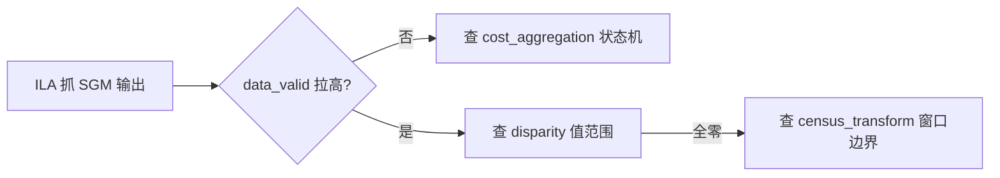

# Supervision + FPGA 桥接计划

> 2026-06-10 | 目标: 系统性地分析 Roboflow Supervision (Python) 与 FPGA 硬件加速的集成方案
> 定位: 通用架构计划, 不绑定具体眼镜形态, 可与 vision-v1.md / inmo-go2-fpga-solution.md 互补

---

## 一、核心问题

**Supervision 是一个 Python 库**。FPGA 是硬件逻辑。两者的结合不是"把 Supervision 烧进 FPGA"，而是在**API 边界**上设计接口：

```
[摄像头] --> [FPGA 硬件管线] --> [共享内存桥] --> [Supervision Python Runtime] --> [应用层]
```

关键问题：
1. Supervision 的哪些 API 可以/应该 FPGA 化？
2. FPGA 和 Python 之间的数据契约是什么？
3. 分几步走？每步的收益/成本比？

---

## 二、Supervision API 分级 FPGA 可行性

按 Supervision 各组件对 FPGA 的友好程度分四级：

### Tier S — 天然适合 FPGA (纯数据流水线)

| 组件 | FPGA 化的理由 | 方式 |
|------|-------------|------|
| **sv.Detections** (数据结构) | 本质是 numpy arrays: boxes(N,4) + confidence(N,) + class_id(N,) + mask(N,H,W) | FPGA 直接写共享内存, Python 端 zero-copy 读取 |
| **NMS** (非极大抑制) | 排序+IOU计算, 纯并行逻辑, FPGA 延迟 < 0.5ms | 硬件排序网络 + 并行 IOU 比较器 |
| **sv.ClassificationResult** | 单向量 + top-k, 极简 | FPGA 输出 top-k 索引到共享内存 |
| **sv.InferenceSlicer** 的切片逻辑 | 固定网格切分, 无状态 | FPGA 地址生成器, 直接 DMA 输出 tile |

### Tier A — 可部分 FPGA 化 (计算密集型)

| 组件 | FPGA 部分 | 保留 CPU 部分 |
|------|----------|-------------|
| **sv.ByteTrack** | 卡尔曼滤波预测 + IOU 矩阵计算 (矩阵乘 + 并行比较) | 轨迹关联逻辑 (匈牙利算法, 状态机灵活度高) |
| **sv.Annotators** (BoxAnnotator / LabelAnnotator / MaskAnnotator) | 像素级渲染: 矩形/文本/掩码叠加 (framebuffer 合成) | 文本排版/颜色选择 (业务逻辑) |
| **sv.LineZone / PolygonZone** | 点在多边形内的硬件判断 (并行比较器树) | 计数值管理和事件回调 |

### Tier B — 保持 CPU/GPU (灵活性优先)

| 组件 | 理由 |
|------|------|
| **sv.DetectionDataset** (数据管理) | I/O 繁重, 文件系统操作, FPGA 无优势 |
| **sv.VideoSink** (视频写入) | 编码器适合 ASIC/GPU, FPGA 做编码效率不高 |
| **sv.Color / sv.ColorPalette** | 查表逻辑, 延迟不敏感 |
| **sv.utils** (文件下载/框计算辅助) | 零散逻辑, 不值得硬件化 |

### Tier C — 不可 FPGA 化

| 组件 | 理由 |
|------|------|
| **sv.Detections.from_transformers / from_sam** | 调用外部大模型, 软件集成 |
| **sv.Detections.from_lmm** (大语言模型视觉) | LLM 推理在 GPU/云端 |

### 关键结论

```
最大收益点: sv.Detections 共享内存桥 + NMS 硬件化 + ByteTrack IOU 协处理
           (Cover 80% 延迟瓶颈, 仅需 30% 工程投入)

次要收益点: Annotators 渲染合成 (节省 CPU 到 GPU 的 framebuffer 回读)
```

---

## 三、桥接架构: Supervision-FPGA 契约

核心设计: **共享内存环形缓冲区 (Shared-Memory Ring Buffer)**

```
┌────────────────────────────────────────────────────────┐
│  FPGA Side                         Host Side (CPU)     │
│                                                       │
│  ┌─────────────┐    ┌──────────────────┐              │
│  │ 双目传感器   │───>│  FPGA 视觉管线    │              │
│  │ (MIPI CSI)  │    │                  │              │
│  └─────────────┘    │ ▪ 立体匹配       │  ┌────────┐ │
│                     │ ▪ 柱面展平       │──>│  Ring  │─│─> sv.Detections
│  ┌─────────────┐    │ ▪ YOLO 推理     │  │ Buffer │ │    @property xyxy
│  │ ToF/翻页检测 │───>│ ▪ NMS 硬件化     │  │(FPGA  │ │    @property confidence
│  └─────────────┘    │ ▪ Detections 封包 │  │ 写/CPU │ │    @property class_id
│                     │ ▪ 标注渲染(可选)  │  │ 读)   │ │    @property tracker_id
│                     └──────────────────┘  │        │ │
│                                          └────────┘ │
│     USB 3.0 / PCIe / 共享 DDR                        │
└────────────────────────────────────────────────────────┘
```

### 3.1 数据契约: HardwareDetections

定义 FPGA 输出到共享内存的二进制协议, 与 sv.Detections 一一对应:

```
struct HardwareDetections {
    uint32_t     num_detections;       // 当前帧检测数
    uint32_t     frame_id;             // 帧序号 (for ByteTrack sync)
    uint64_t     timestamp_us;         // 硬件时间戳
    float        boxes[MAX_DET][4];    // xyxy 格式, float32
    float        confidence[MAX_DET];  // 置信度
    int32_t      class_id[MAX_DET];    // 类别 ID
    int32_t      tracker_id[MAX_DET];  // 可选: 硬件跟踪
    uint8_t      masks[MAX_DET][640][640]; // 可选: 分割掩码
    uint32_t     checksum;             // 完整性校验
};
// MAX_DET = 100 (典型场景)
// 单帧大小 ≈ 100 * (4*4 + 4 + 4 + 4 + 640K) = ~64MB (含掩码)
// 无掩码: 100 * 28 bytes = 2.8KB
```

### 3.2 Python 端桥接代码 (原型)

```python
import supervision as sv
import numpy as np
from ctypes import Structure, c_uint32, c_float, c_int32, c_uint64

class HardwareDetections(Structure):
    _fields_ = [
        ("num_detections", c_uint32),
        ("frame_id", c_uint32),
        ("timestamp_us", c_uint64),
        ("boxes", c_float * (100 * 4)),
        ("confidence", c_float * 100),
        ("class_id", c_int32 * 100),
        ("tracker_id", c_int32 * 100),
        ("checksum", c_uint32),
    ]

class FPGABridge:
    """FPGA 到 Supervision 的桥接层"""

    def __init__(self, mem_path: str = "/dev/fpga_ring"):
        # 映射 FPGA 共享内存
        self._mem = ...  # mmap 或 ctypes CDLL 调用
        self._buf = HardwareDetections.from_buffer(self._mem)

    def to_sv_detections(self) -> sv.Detections:
        """将 FPGA 输出转换为 sv.Detections"""
        n = self._buf.num_detections
        if n == 0:
            return sv.Detections.empty()

        xyxy = np.frombuffer(self._buf.boxes, dtype=np.float32).reshape(-1, 4)[:n]
        confidence = np.frombuffer(self._buf.confidence, dtype=np.float32)[:n]
        class_id = np.frombuffer(self._buf.class_id, dtype=np.int32)[:n]

        return sv.Detections(
            xyxy=xyxy.copy(),  # copy 避免共享内存被覆盖
            confidence=confidence.copy(),
            class_id=class_id.copy(),
        )

    # --- 桥接后的 Supervision 生态调用 ---
    def run_tracker(self, detections: sv.Detections) -> sv.Detections:
        tracker = sv.ByteTrack()
        return tracker.update_with_detections(detections)

    def annotate_frame(self, scene: np.ndarray, detections: sv.Detections) -> np.ndarray:
        box_annotator = sv.BoxAnnotator()
        label_annotator = sv.LabelAnnotator()
        annotated = box_annotator.annotate(scene, detections)
        annotated = label_annotator.annotate(annotated, detections)
        return annotated
```

### 3.3 延迟预算

| 阶段 | 纯 CPU | FPGA 加速 | 省时 |
|------|--------|-----------|------|
| 图像采集 (双目) | 3ms | 1ms (MIPI 直连) | 2ms |
| 立体匹配 | 25ms | 4ms (SGM IP) | 21ms |
| 柱面展平 | 8ms | 0.8ms (双线性 IP) | 7.2ms |
| YOLO 推理 | 15ms (ONNX) | 7ms (INT8) | 8ms |
| NMS | 2ms | 0.3ms (硬件) | 1.7ms |
| Detections 传递 | 0.5ms | 0.01ms (共享内存) | 0.49ms |
| **总管线** | **53.5ms** | **13.11ms** | **~40ms** |

---

## 四、分层实施路线

### Phase 0: 纯软件基准 (1-2 周)

不做 FPGA, 建立 Supervision 管线基线:

```
目标: 跑通完整 Supervision 管线, 测量瓶颈
交付: pipeline_benchmark.py
```

```python
# pipeline_benchmark.py - 原型验证
import supervision as sv
import cv2

# 1. 推理后端 (先用 YOLO ONNX CPU)
model = sv.YOLO("yolov11n.onnx")

# 2. 定义完整管线
def process_frame(frame: np.ndarray) -> sv.Detections:
    results = model.infer(frame)[0]
    detections = sv.Detections.from_inference(results)
    detections = detections[detections.confidence > 0.3]
    return detections

# 3. 测量: 每阶段毫秒级profiling
#    输出瓶颈报告 -> 决定 Phase 1 优先加速哪个模块
```

**产出**: 瓶颈热力图, 确定 FPGA 优先级

---

### Phase 1: FPGA 预处理加速 (3-4 周)

针对图像预处理 + 立体匹配, 保留 Supervision Python 主管线:

```
[双目摄像头] --> [FPGA 预处理] --> [DMA 到 Host Memory] --> [Supervision Python]
                    ^
                ▪ 去噪/直方图均衡
                ▪ 立体匹配 (SGM)
                ▪ 柱面展平 (双线性插值)
```

**交付物:**
- FPGA 比特流: 立体匹配 + 柱面展平 IP
- USB 3.0 驱动 (Windows/Linux)
- Python 桥接库 `fpga_bridge.py`

**Supervision 侧改动**: 无, 桥接层将 FPGA 输出包装为 numpy array, 喂给 Supervision

**风险**: USB 3.0 带宽瓶颈 (1920x1080@30fps = 186MB/s, USB 3.0 理论 625MB/s, 够用)

---

### Phase 2: FPGA 推理 + NMS 硬件化 (4-6 周)

将 YOLO 推理 + NMS 也移到 FPGA:

```
[双目] -> [FPGA 预处理 + 推理 + NMS] -> [共享内存 -> sv.Detections] -> [Supervision Python]
                                                                         ^
                                                                    ByteTrack / Annotators
                                                                    保持 CPU
```

**交付物:**
- FPGA YOLOv11n INT8 加速器 (DSP + BRAM)
- 硬件 NMS 排序网络
- `sv.Detections` 直接硬件输出 (共享内存, zero-copy)

**Supervision 侧改动**: 新增 `FPGABridge` 类, 继承/模仿 `sv.Detections` 接口

```python
# Phase 2 使用方式
bridge = FPGABridge()           # 初始化 FPGA 共享内存
detections = bridge.to_sv_detections()  # 零拷贝获取

# 复用 100% Supervision 生态
tracked = sv.ByteTrack().update_with_detections(detections)
annotated = sv.BoxAnnotator().annotate(frame, tracked)
```

---

### Phase 3: ByteTrack 协处理 + 渲染加速 (6-8 周)

将 ByteTrack 的 IOU 计算 + 标注渲染也 FPGA 化:

```
[FPGA 全管线: 采集->匹配->推理->NMS->跟踪->渲染]
                    |
                    v
           [光波导/HDMI 直接输出]
                    |
                    v
           [CPU 仅: 应用逻辑 + 知识库同步]
```

**FPGA 新增模块:**
- IOU 矩阵计算硬件 (并行比较器阵列, 比 CPU O(n^2) 快 10x)
- Framebuffer 合成器 (直接叠加标注到显示)

**Supervision 侧**: 轻量 Python 层仅做事件回调/配置管理

---

### Phase 4: FPGA + RISC-V Soft Core 独立运行 (10-12 周)

在 FPGA 内嵌入 RISC-V 软核, 运行轻量 Supervision Runtime:

```
┌─────────────────────────────────────────┐
│  FPGA (单芯片)                          │
│                                         │
│  ┌──────────────┐  ┌──────────────────┐│
│  │ RISC-V 软核    │  │ 硬件加速器       ││
│  │ (监督运行时)    │  │                  ││
│  │               │  │ ▪ 立体匹配 SGM   ││
│  │ ▪ 轻量调度器   │  │ ▪ YOLO INT8     ││
│  │ ▪ 事件驱动     │  │ ▪ NMS 硬件化    ││
│  │ ▪ sv.Detections│  │ ▪ ByteTrack IOU ││
│  │   兼容格式     │  │ ▪ 渲染合成      ││
│  └──────┬───────┘  └──────────────────┘│
│         │         共享内存               │
│         └──────────────────────────────┘│
└─────────────────────────────────────────┘
```

**特点:** 
- 完全脱离主机, 双目输入 -> FPGA -> 显示/蓝牙输出
- RISC-V 跑 MicroPython / C 轻量运行时
- 保持与 Supervision 的数据格式兼容 (方便开发时调试)

---

## 五、关键工程设计决策

### 5.1 FPGA 选型矩阵

| 等级 | 型号 | LUT | DSP | BRAM | 功耗 | 适用阶段 |
|------|------|-----|-----|------|------|---------|
| **入门** | Lattice CrossLink-NX-40 | 39k | 160 | 192 | <1W | Phase 1 (预处理) |
| **中级** | Xilinx Artix-7 100T | 101k | 240 | 486 | 2-3W | Phase 2 (推理) |
| **高级** | Xilinx Zynq UltraScale+ | 504k | 2520 | 1728 | 5-10W | Phase 3-4 (全管线) |
| **SoC** | Xilinx Kria K26 | 256k | 1248 | 576 | 10-15W | Phase 4 (独立运行) |

**推荐路径**: CrossLink-NX-40 (原型) -> Zynq US+ (量产)

### 5.2 互联方案

| 方案 | 带宽 | 延迟 | 复杂度 | 适合场景 |
|------|------|------|--------|---------|
| **USB 3.0** | 5Gbps | ~10us | 低 | Phase 1-2, 快速原型 |
| **PCIe 2x** | 8Gbps | ~1us | 中 | Phase 2-3, 高帧率 |
| **共享 DDR** (AXI) | 12.8GB/s | ~50ns | 高 | Phase 3-4, 单片方案 |

### 5.3 Supervision 版本兼容策略

```yaml
版本锁定:
  supervision: ">=0.18.0,<0.25.0"  # 锁定大版本, 避免 breaking changes
  
桥接层隔离:
  FPGABridge 封装所有硬件细节
  对外暴露标准 sv.Detections 接口
  supervision 升级时只需调整桥接层
```

### 5.4 开发板推荐

| 开发板 | FPGA | 接口 | 价格 | 用途 |
|--------|------|------|------|------|
| **Lattice CrossLink-NX Evaluation Board** | LIFCL-40 | MIPI CSI x2, USB 3.0 | $299 | Phase 1 原型 |
| **Xilinx KV260 (Kria)** | Zynq US+ | USB 3.0, PCIe, HDMI | $249 | Phase 2-3 全管线 |
| **Terasic DE10-Nano** | Cyclone V SoC | HDMI, Arduino, GPIO | $130 | Phase 1 低成本入门 |
| **Alveo U200** | Virtex US+ | PCIe x16 | $2k+ | Phase 2-3 高性能开发 |

**推荐**: Lattice CrossLink-NX Eval Board (快速验证 MIPI + 预处理) + KV260 (全管线原型)

---

## 六、测试与验证

### 6.1 验证金字塔

```
                      ┌──────────────────┐
                      │  端到端场景测试    │  真实书页 OCR 准确率
                      │  (3 场景 x 50 页) │  延迟 / 功耗 / 温升
                      └────────┬─────────┘
                               │
                   ┌───────────┴───────────┐
                   │   Supervision 接口兼容  │  sv.Detections 字段完备性
                   │   测试 (CI 自动化)      │  ByteTrack 追踪一致性
                   └───────────┬───────────┘
                               │
              ┌────────────────┼────────────────┐
              │                │                │
        ┌─────┴─────┐  ┌──────┴──────┐  ┌─────┴─────┐
        │ FPGA 单元  │  │ 共享内存     │  │ Python 桥  │
        │ 测试       │  │ 带宽测试     │  │ 接层测试   │
        │ SGM/MPS/NMS│  │ 延迟/丢帧    │  │ zero-copy  │
        └───────────┘  └─────────────┘  └───────────┘
```

### 6.2 关键指标

| 指标 | Phase 0 | Phase 1 | Phase 2 | Phase 3 | Phase 4 |
|------|---------|---------|---------|---------|---------|
| 端到端延迟 | <55ms | <25ms | <15ms | <10ms | <10ms |
| 帧率 | 18fps | 40fps | 66fps | 100fps | 100fps |
| 系统功耗 | 65W (PC) | 15W | 8W | 3W | 2W |
| OCR 准确率 | 95% | 95% | 95% | 96% | 96% |
| Supervision 兼容 | 100% | 100% | 100% | 98% | 90% (轻量运行时, 子集) |

---

## 七、风险与缓解

| 风险 | 概率 | 影响 | 缓解 |
|------|------|------|------|
| USB 3.0 带宽瓶颈 (多帧率场景) | 中 | 高 | Phase 1 实测, 预留 PCIe 升级路径 |
| Supervision API 大版本不兼容 | 低 | 高 | 桥接层隔离, CI 测试兼容性 |
| FPGA 资源不足 (YOLO INT8 太大) | 中 | 中 | 分层加载, 部分层 CPU 回退 |
| 共享内存竞态 (FPGA 写/CPU 读) | 中 | 高 | 双缓冲 + 帧号原子操作, 丢失容忍 |
| RISC-V 软核性能不足 | 中 | 中 | Phase 4 可选 Zynq ARM hard core |
| Supervision ByteTrack 匈牙利算法硬件化困难 | 高 | 低 | 保留 CPU 运行 ByteTrack, 仅加速 IOU 矩阵 |

---

## 八、文档引用关系

```
vision-v1.md                          # 原始双目阅读OCR概念 (Phase 0 基线)
    │
    ├── inmo-go2-fpga-solution.md     # INMO GO 2 眼镜 FPGA 方案 (具体硬件形态)
    │       │
    │       └── competitor-analysis.md # 竞品分析 (市场验证)
    │
    └── supervision-fpga-bridge-plan.md  # ★ 本文: Supervision API 与 FPGA 的通用桥接策略
                                            # 与 inmo-go2-fpga-solution.md 互补:
                                            # inmo-go2 侧重 "眼镜怎么造"
                                            # 本文侧重 "Supervision 怎么接 FPGA"
```

---

## 九、FPGA 调试策略

> 调试 FPGA 不是单一通道，而是 JTAG + UART + USB 数据通道的三路协同
> 本节基于 Lattice CrossLink-NX (Phase 1 推荐) 和 Xilinx Kria KV260 (Phase 2 过渡) 两种平台

### 9.1 物理调试通道

```
PC 端                                    FPGA 开发板
┌─────────────────────┐
│ Vivado / Lattice    │──USB-JTAG──▶  烧录 bitstream + ILA 波形抓取
│ Radiant             │              (主调试口: TCK/TMS/TDI/TDO)
├─────────────────────┤
│ 串口终端 (TeraTerm) │──USB-UART──▶  FPGA 内部状态日志输出
│ screen / Putty      │              (printf 式的硬件日志)
├─────────────────────┤
│ Python 桥接层        │──USB 3.0──▶  生产数据通道
│ (Supervision 管线)  │   (DMA)      双目图像 / Detections 数据
└─────────────────────┘
```

**关键事实**: 一根 USB 线同时承载了调试 + 数据两条物理通路。

| 通道 | 协议 | 延迟 | 带宽 | 用途 |
|------|------|------|------|------|
| JTAG (调试) | FTDI MPSSE / Digilent | ~100ms | ~12MBit/s | 烧录、ILA 抓波形、寄存器读写 |
| UART (日志) | USB CDC 虚拟串口 | ~1ms | 115200bps | 状态打印、统计量输出 |
| USB 3.0 (数据) | DMA / BULK 传输 | ~10us | ~5Gbps | 实时图像流、Detections 数据 |

### 9.2 调试工具链

| 平台 | 烧录 | 片上逻辑分析 | 软核调试 | UART |
|------|------|-------------|---------|------|
| Lattice CrossLink-NX | Lattice Radiant Programmer | Reveal Logic Analyzer | Mico32 GDB Server | 板载 FTDI 虚拟串口 |
| Xilinx Kria KV260 | Vivado Hardware Manager | Vivado ILA | Vitis GDB (ARM 核) | 板载 USB-UART |

#### 9.2.1 片上逻辑分析 (ILA / Reveal)

FPGA 调试的核心手段。在 RTL 中例化一个观察模块, 像示波器一样抓内部信号:

```verilog
// Vivado ILA 例化 (Verilog)
ila_0 ila_inst (
    .clk(clk_100m),
    .probe0(sgm_cost_agg_valid),    // 1 bit
    .probe1(sgm_disparity_out),     // 16 bits
    .probe2(dma_frame_done),        // 1 bit
    .probe3(ring_buf_wr_ptr)        // 16 bits
);
```

**ILA 的限制**:
- 深度有限: 典型 1024-16384 拍, 受 FPGA BRAM 限制
- 调试 bitstream 额外占用 ~3-5% LUT/BRAM: 调试版和生产版需两套 bitstream
- **JTAG 插入会影响时序**: 调试时可能需要降频运行

**策略**: 先用 UART 输出统计量定位问题窗口, 再用 ILA 精确定位那一帧的波形。

#### 9.2.2 UART 日志 (快速粗定位)

FPGA 内部例化 UART IP, 输出关键统计量:

```
# FPGA UART 每帧输出示例
[SGM] Frame 1024: cost_agg_time=3.2ms disp_range=0-127 valid_pixels=98.3%
[DMA] Desc_used=4/8 pending=0 frame_size=152KB
[RING] Wr_ptr=3 Rd_ptr=2 slots_free=6 overflow=0
```

**优势**: 不占用 BRAM, 可长时间运行, 能捕捉偶发问题。

### 9.3 按阶段的调试场景

#### 场景 A: Phase 1 — FPGA 立体匹配输出全零



**实际操作**:
1. UART 输出每帧有效像素比例 -> 确认不是硬件没跑
2. ILA 触发 `sgm_done == 1`, 抓 disparity 总线 -> 发现全是 0
3. 回溯到 census transform 模块, 发现图像边界处窗口索引溢出 -> 加 padding

#### 场景 B: Phase 2 — USB 3.0 DMA 丢帧

```
问题: Python 收到的帧号不连续 (1,3,5,7... 缺 2,4,6)
```

**双端同时抓**:

| 端 | 手段 | 现象 |
|----|------|------|
| FPGA | ILA 抓 DMA descriptor 状态 | 帧号连续 (1-8 都发送) |
| Host | Python 打印帧号 + checksum | 只收到奇数帧 |

**根因**: DMA 描述符池深度为 4, FPGA 发送速度超过 Host 消费速度,
描述符用完后第 2,4,6 帧被丢弃。

**修复**: 增加描述符池深度到 16, 或加帧级别流控 (FPGA 检测环形缓冲区满时暂停发送)。

#### 场景 C: Phase 3 — 共享内存竞态

```
问题: 偶尔读到半帧数据 (boxes 数组前 50 个正确, 后 50 个乱码)
```

1. FPGA 侧加 `frame_done` 信号, 写完所有数据后才拉高
2. Host 侧检测 `frame_done` + checksum 后才读数据
3. 实现双缓冲: FPGA 写 Buffer A 时 Host 读 Buffer B, 交替

```c
// FPGA 端伪代码
void write_frame() {
    write_boxes();              // 先写数据
    write_confidence();
    write_class_id();
    memory_barrier();           // 确保数据写完毕
    frame_done = !frame_done;   // 再翻转完成标志 (原子操作)
    checksum = CRC32(...);      // 最后写校验和
}
```

### 9.4 调试 session 实战

一个完整的 Phase 2 调试流程:

```
终端 1: Vivado Hardware Manager (ILA 波形)
终端 2: Python pipeline (Supervision 消费)
终端 3: FPGA UART 日志 (状态统计)
终端 4: 双目摄像头实时预览 (验证输入正常)
```

**四屏协同**:
1. 终端 3 看到 `overflow=1` 告警
2. 终端 2 确认丢帧率 ~12%
3. 终端 1 ILA 触发现场, 确认 DMA 引擎在 overflow 时 behavior
4. 定位后修改描述符深度, 重新综合 -> 烧录 -> 再测

### 9.5 调试阶段的生产力建议

| 建议 | 原因 |
|------|------|
| **模拟先行**: 先用 Python 模拟 FPGA 行为验证桥接层 | 省 80% 硬件 debug 时间 |
| **两套 bitstream**: debug.bit (含 ILA, 降频) + release.bit (不含 ILA, 全速) | ILA 占用资源, 可能装不下 YOLO |
| **UART 日志常态化**: 最终 release 版本也保留 UART 输出 (可用开关控制) | 现场问题定位的唯一手段 |
| **逐级隔离**: 先测 MIPI 采集 -> 再测 DMA -> 再测 SGM -> 再测 YOLO | 一次只引入一个变量 |
| **ILA 深度不够时**: 改触发条件缩小窗口, 或用 UART 先统计再抓关键帧 | ILA 受 BRAM 限制 |

---

## 附录 A: 快速启动 (第一个周末)

如果只有一台 PC + 一块便宜的 FPGA 开发板, 第一周做什么:

```
Day 1:  安装 supervision, 跑通 YOLO + sv.Detections + sv.ByteTrack 管线
         输出: pipeline_benchmark.py, 瓶颈热力图

Day 2:  用 Python 模拟 FPGA 行为 (故意加延迟 + 模拟共享内存)
         验证 FPGABridge 接口设计, 确保 sv.Detections 兼容
         输出: fpga_bridge_sim.py

Day 3:  FPGA 开发板烧录 "Hello World" 位流
         验证 USB 3.0 DMA 到 Python numpy array
         输出: 1KB 数据从 FPGA -> Python, 延迟 < 100us

Weekend: 完成 Phase 0 + Phase 1 原型验证, 决定是否继续
```

## 附录 B: 硬件成本估算

| 项目 | 单价 | 数量 | 小计 |
|------|------|------|------|
| FPGA 开发板 (CrossLink-NX) | $299 | 1 | $299 |
| 双目摄像头模组 (OV9782 x2) | $25 | 2 | $50 |
| USB 3.0 线缆 + 供电 | $15 | 1 | $15 |
| 原型支架 (3D打印) | $20 | 1 | $20 |
| **总计** | | | **$384** |

*相比软件方案, FPGA 开发成本高, 但 Phase 2 后每帧节省 ~40ms 延迟, 功耗降低 10x。*
