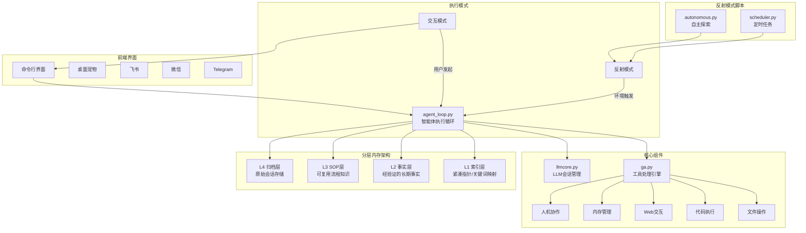
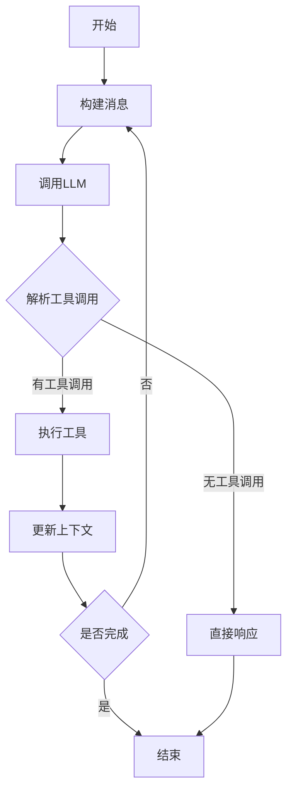
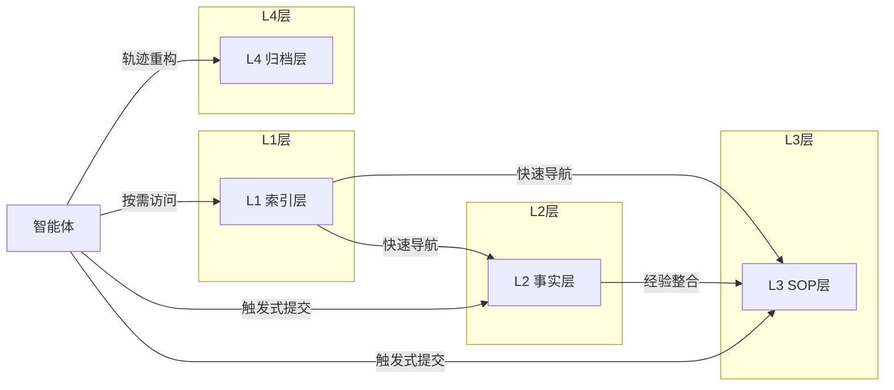
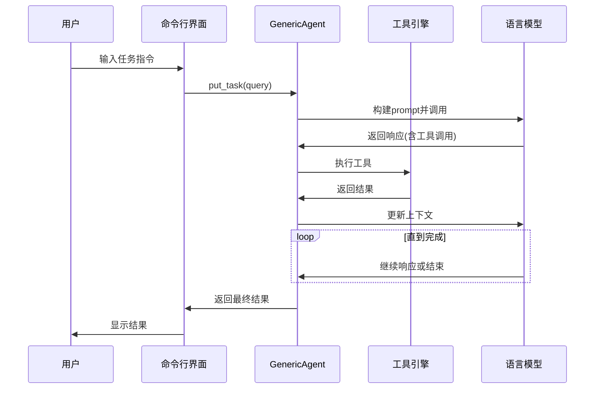
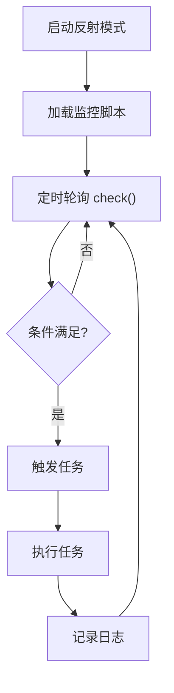
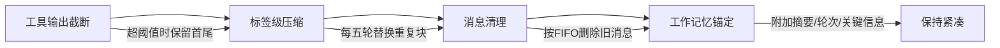
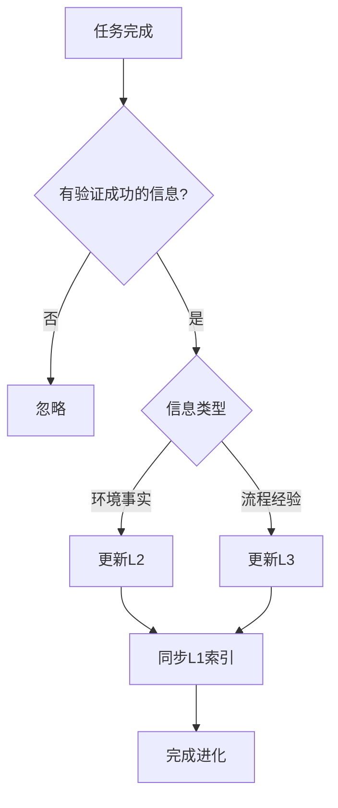

# GenericAgent 项目架构概述

## 一、项目定位

**GenericAgent（GA）** 是一个通用型自进化LLM智能体系统，旨在实现本地计算环境内任务自动化。其核心设计理念是通过优化上下文信息密度来提升智能体性能，而非单纯扩展上下文长度。

## 二、核心设计原则

| 原则 | 描述 |
|-----|------|
| **工具最小化** | 将工具设计限制在必要的最小集合内，避免上下文膨胀 |
| **分层记忆** | 仅保留小型常驻可见层，深层记忆按需访问 |
| **自我进化** | 通过记录与更新模型运行的信息环境实现跨任务经验整合 |
| **上下文压缩** | 采用字符域启发式方法管理上下文预算 |

## 三、系统架构图



## 四、核心模块详解

### 4.1 智能体执行循环（agent_loop.py）



**核心职责**：
- 每一步将全局记忆与当前任务规范结合形成执行上下文
- LLM处理后生成输出或工具调用
- 工具执行结果以结构化信号更新系统状态

### 4.2 工具引擎（ga.py）

GA工具集由9种原子工具构成，分为五大能力类别：

| 类别 | 工具 | 功能 |
|-----|------|------|
| 文件操作 | `file_read` | 读取文件内容，支持关键词搜索 |
| | `file_patch` | 精准编辑，寻找唯一匹配块进行替换 |
| | `file_write` | 块写入，支持覆盖/追加/前置模式 |
| 代码执行 | `code_run` | 受控运行时内执行Python/Bash代码 |
| Web交互 | `web_scan` | 获取页面简化HTML内容和标签页列表 |
| | `web_execute_js` | 执行JS脚本控制浏览器 |
| 内存管理 | `update_working_checkpoint` | 短期上下文维护 |
| | `start_long_term_update` | 长期记忆提炼 |
| 人机协作 | `ask_user` | 需要用户决策时调用 |

### 4.3 分层内存架构



| 层级 | 存储内容 | 特点 |
|-----|---------|------|
| **L1 索引层** | 紧凑指针（高频入口、关键词映射、硬约束） | 常驻内存核心，快速导航 |
| **L2 事实层** | 经验证的长期稳定事实 | 严格准入，排除瞬态信息 |
| **L3 SOP层** | 可复用流程性知识（工作流、前置条件、故障处理） | 支持复杂任务经验积累 |
| **L4 归档层** | 历史会话原始数据 | 用于轨迹重构与审计 |

### 4.4 LLM会话管理（llmcore.py）

支持多种LLM后端：

| 会话类型 | 描述 |
|---------|------|
| `ClaudeSession` | Anthropic Claude API |
| `LLMSession` | OpenAI兼容API |
| `NativeClaudeSession` | Claude原生协议 |
| `NativeOAISession` | OpenAI原生协议 |
| `MixinSession` | 多会话容错回退 |

## 五、执行模式

### 5.1 交互模式

用户通过CLI或前端界面发起任务，智能体按步骤执行：



### 5.2 反射模式

无需用户指令，持续监控环境变化：



**典型应用**：
- **看门狗**：监控文件、日志等变化，触发对应任务
- **定时任务**：按时间规则生成GA任务

## 六、项目目录结构

```
GenericAgent/
├── agentmain.py          # 主入口
├── agent_loop.py         # 核心执行循环
├── ga.py                 # 工具引擎
├── llmcore.py            # LLM会话管理
├── TMWebDriver.py        # Web驱动
├── simphtml.py           # HTML简化处理
├── frontends/            # 前端界面
│   ├── desktop_pet.pyw   # 桌面宠物
│   ├── chatapp_common.py # 聊天应用公共模块
│   ├── stapp.py          # Streamlit界面
│   ├── qtapp.py          # Qt界面
│   └── ...               # 其他前端
├── memory/               # 分层内存
│   ├── global_mem.txt    # L2事实存储
│   ├── global_mem_insight.txt # L1索引
│   ├── L4_raw_sessions/  # L4归档
│   ├── skill_search/     # 技能搜索
│   └── *sop.md           # L3 SOP文档
├── reflect/              # 反射模式脚本
│   ├── autonomous.py     # 自主探索
│   └── scheduler.py      # 定时任务
├── plugins/              # 插件
│   └── langfuse_tracing.py
└── assets/               # 资源
    ├── sys_prompt.txt    # 系统提示词
    ├── tools_schema.json # 工具定义
    └── ...
```

## 七、上下文压缩机制

GA采用四阶段修剪机制控制上下文长度：



| 阶段 | 处理方式 |
|-----|---------|
| **工具输出截断** | 单工具输出超阈值时保留首尾，替换中间部分 |
| **标签级压缩** | 每五轮替换重复工作记忆块为占位符 |
| **消息清理** | 超预算时重新压缩并按先进先出删除旧消息 |
| **工作记忆锚定** | 每条新消息附加最新对话摘要、轮次编号与关键信息 |

## 八、自我进化机制

GA通过选择性整合实现跨任务经验积累：



**核心规则**：
1. **进化策略而非工具**：固定工具层与进化知识层分离
2. **知识积累**：L1自动追踪新L2事实与L3流程
3. **质量控制**：仅保留经工具执行验证的信息
4. **故障处理**：局部调整重试 → 切换新策略 → 请求人工干预

## 九、技术特点总结

| 特性 | 说明 |
|-----|------|
| **模型无关** | 底层推理引擎可替换（Claude、GPT、Gemini等） |
| **代码极简** | 核心代码约3300行，智能体循环仅92行 |
| **接口极简** | 以自托管CLI为原生执行界面 |
| **子智能体调度** | 支持并行任务的映射归约工作流 |
| **热更新** | 反射模式脚本可运行时更新，无需重启 |

## 十、典型应用场景

1. **自动化办公**：文件处理、数据整理、报告生成
2. **Web自动化**：网页抓取、表单填写、数据采集
3. **定时任务**：定期报告、数据备份、系统监控
4. **自主探索**：技能学习、任务规划、经验积累